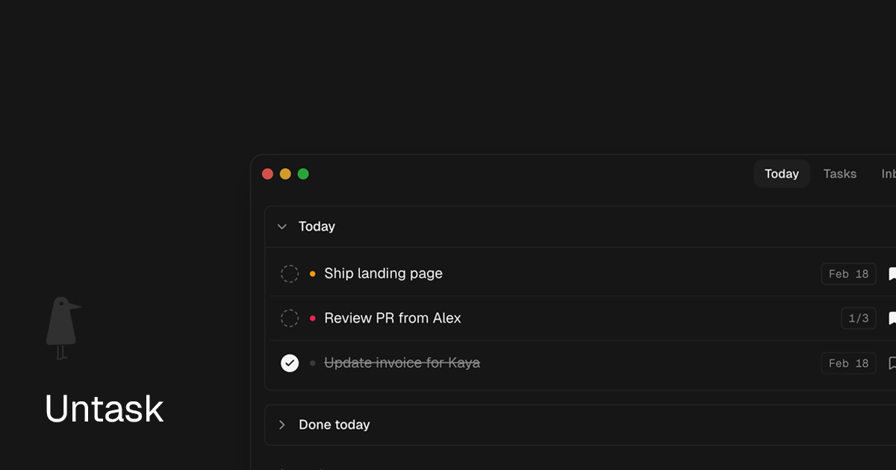

<p align="center">
  
</p>

<h1 align="center">Untask</h1>

<p align="center">
  A local-first task manager for macOS with an optional AI assistant.<br/>
  No account. No cloud. No subscription. Your data stays on your Mac.
</p>

<p align="center">
  <a href="https://github.com/mbenhard/untask/releases/latest"></a>
  
  
  <a href="https://unta.sk"></a>
</p>

<br/>

<p align="center">
  
</p>

<br/>

## What is Untask?

I spent a long time testing task apps. None of them fit. So I built my own — and open sourced it in case it fits you too.

Untask runs entirely on your Mac. Tasks, notes, and conversations are stored in a local SQLite database. Nothing leaves your machine unless you explicitly connect an AI provider. No account, no sync, no subscription.

It's built for speed and keyboard control. The kind of app that gets out of your way.

### Who is it for?

- macOS users who've tried every task app and none of them stuck
- Developers and power users who want keyboard shortcuts over mouse clicks
- People who care about data privacy and want local-first software
- Anyone curious about AI assistants but who wants to stay in control — bring your own key, or skip AI entirely

## Features

### Task Management

- **Configurable status lanes** — customize your workflow columns (e.g. Todo, In Progress, Done, or whatever you want)
- **Drag-and-drop reordering** — organize tasks the way you think
- **Due dates** — set deadlines with natural language ("tomorrow", "next friday")
- **Priority levels** — color-coded indicators so urgent tasks stand out
- **Clipboard quick-add** — global shortcut (`Ctrl+Space`) to capture a task from anywhere on your Mac
- **Full-text search** — find anything across all your tasks and notes instantly
- **Undo support** — every task change is logged, so you can reverse mistakes
- **Backup & restore** — export your data anytime, import it back if needed

### Notes

- **Rich text editor** — powered by BlockNote with formatting, headings, lists, and more
- **File attachments** — drag and drop images and files directly into notes
- **Linked to tasks** — attach notes to specific tasks for context

### AI Assistant (optional)

The AI assistant is completely opt-in. Untask works perfectly fine without it. If you do want to use it:

- **Bring your own key** — supports OpenRouter, OpenAI, Anthropic, and Ollama (local models)
- **Chat panel** — multi-threaded conversations in a sidebar
- **Task-aware** — the AI can see your tasks and help you organize, prioritize, or break them down
- **Memory system** — builds a profile of your preferences and work patterns over time (stored locally, fully editable)
- **Proactive nudges** — optional reminders when deadlines approach or tasks pile up

### Design

- **Dark mode default** with light mode support
- **Keyboard-first** — navigate everything without touching the mouse
- **Tray app** — lives in your menu bar with a today-count badge
- **Dock mode** — toggle between tray-only and regular dock app
- **Minimal and fast** — no animations, no clutter, just your tasks

## Install

### Homebrew (recommended)

```sh
brew install mbenhard/untask/untask
```

### Manual download

1. Go to [Releases](https://github.com/mbenhard/untask/releases/latest)
2. Download the `.zip` file
3. Unzip and drag **Untask.app** to your Applications folder

### macOS Gatekeeper notice

Untask is not notarized through the Apple Developer Program, so macOS will block the first launch. This is normal for open-source apps distributed outside the Mac App Store.

**To open it:**

1. Try to open Untask — macOS will show a warning
2. Go to **System Settings > Privacy & Security** and click **Open Anyway**

Or run this in Terminal:

```sh
xattr -cr /Applications/Untask.app
```

## Tech Stack

| Layer | Technology |
|-------|------------|
| App shell | Electron 40 |
| UI | React 19 + TypeScript |
| Styling | Tailwind CSS v4 + Radix UI |
| Database | SQLite (better-sqlite3 + Drizzle ORM) |
| Editor | BlockNote |
| State | Zustand |
| AI | Vercel AI SDK (multi-provider) |
| Build | Electron Forge + Vite |
| Package manager | pnpm |

## Development

### Prerequisites

- **Node.js** 20+
- **pnpm** 9+
- macOS (Electron builds are macOS-only for now)

### Getting started

```sh
git clone https://github.com/mbenhard/untask.git
cd untask
pnpm install
pnpm build:helper   # one-time — builds the native macOS Reminders bridge
pnpm start
```

This will launch the app in development mode with hot reload.

> **Note:** `pnpm build:helper` compiles a small Swift binary for macOS Reminders sync. You only need to run it once. If you skip it, everything works except Reminders sync.

### Common commands

```sh
pnpm start           # Run the app in dev mode
pnpm typecheck       # Type-check all TypeScript configs
pnpm test            # Run tests (Vitest)
pnpm package         # Build the app (unpackaged)
pnpm make            # Build distributable .zip/.dmg
```

### Database migrations

```sh
npm run db:generate  # Generate SQL from schema changes
npm run db:migrate   # Apply pending migrations
```

### Troubleshooting

**Electron binary missing after install:**

```sh
node node_modules/electron/install.js
npx electron-rebuild -f -w better-sqlite3
```

**Native module issues:**

The `.npmrc` includes `node-linker=hoisted` and `symlink=false` — both are required for Electron Forge to correctly package native modules like `better-sqlite3`. Don't change these.

## Project Structure

```
untask/
├── src/
│   ├── main/              # Electron main process
│   │   ├── ai/            # AI providers, tools, memory
│   │   ├── assistant/     # Proactive assistant & nudges
│   │   ├── db/            # SQLite schema + migrations
│   │   ├── ipc/           # IPC handlers (domain-organized)
│   │   ├── lib/           # Shared main-process utilities
│   │   ├── services/      # Task, notes, chat, settings services
│   │   └── window/        # Window management, tray, dock mode
│   ├── preload/           # IPC bridge (typed APIs)
│   ├── renderer/          # React UI
│   │   ├── components/    # All UI components
│   │   ├── hooks/         # Custom React hooks
│   │   ├── lib/           # Shared renderer utilities
│   │   ├── stores/        # Zustand state stores
│   │   ├── styles/        # Global CSS
│   │   └── utils/         # Helpers and formatters
│   └── types/             # Shared TypeScript types
├── drizzle/               # SQL migration files
├── scripts/               # Build and release scripts
├── swift-helper/          # Native macOS Swift helper
├── assets/                # App icons, tray icons
└── docs/                  # Architecture, release docs
```

### Architecture

- **Main process** owns the database, filesystem, tray, shortcuts, and all AI calls
- **Preload** exposes minimal typed IPC channels — renderer never touches Node directly
- **Renderer** is a standard React app that communicates via IPC
- **IPC channels** are domain-organized: `task:*`, `chat:*`, `settings:*`, `note:*`
- **All writes** are validated with Zod before hitting the database
- **Task mutations** are logged to an audit trail for undo support

## Data & Privacy

- **All data is local.** Your database lives at `~/Library/Application Support/Untask/untask.db`
- **No telemetry.** No analytics, no tracking, no phone-home
- **No account required.** There's no sign-up, no cloud, no sync
- **AI is opt-in.** If you connect an AI provider, your tasks/notes are sent to that provider's API for context — but nothing is stored on our end
- **API keys are encrypted** via macOS Keychain when available, with a local fallback for unsigned builds
- **Backups exclude API keys** — your secrets never end up in exported files

## Contributing

See [CONTRIBUTING.md](./CONTRIBUTING.md) for guidelines.

## Changelog

See [CHANGELOG.md](./CHANGELOG.md) for release history.

## License

[MIT](./LICENSE)
